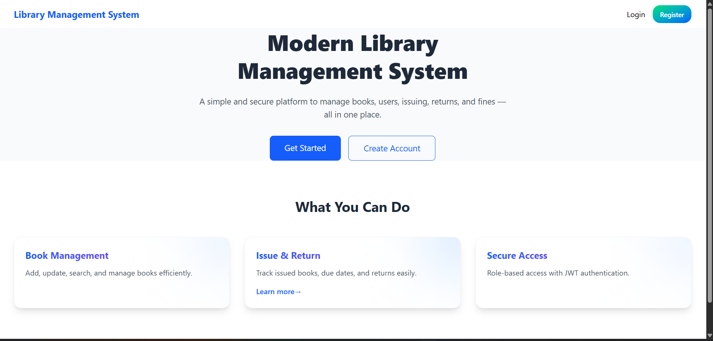
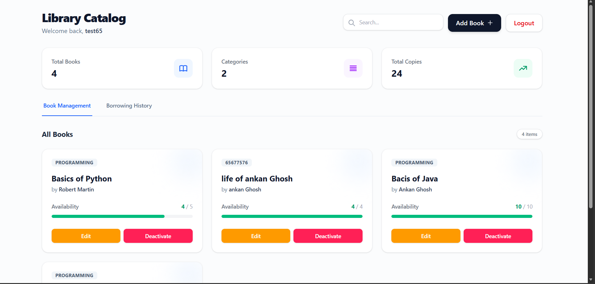
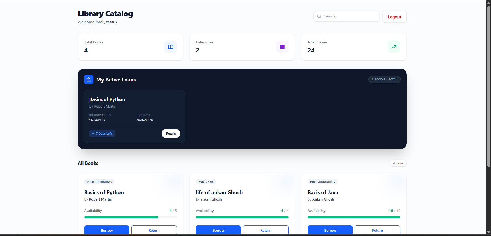
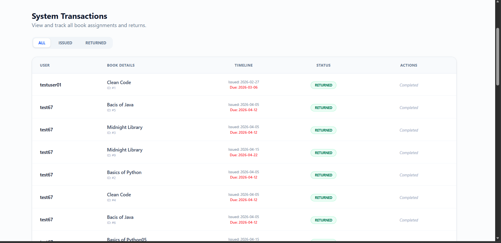

# 📚 Library Management System (Full-Stack)

A modern, high-security library management solution featuring a **Java Spring Boot** backend and a **React** frontend. This project demonstrates a complete CRUD lifecycle, JWT-based security, and advanced role-based administrative workflows.

---


## 📸 System Preview

### 1. Landing & Discovery
The entry point of the application, showcasing a modern, responsive landing page with JWT-secured access.

| App Landing Page | User Catalog View |
| :---: | :---: |
|  |  |

### 2. Management & Administration
Comprehensive tracking for both members (personal loans) and admins (system-wide transactions).

| Personal Loan Tracking (Member) | Admin Transaction History |
| :---: | :---: |
|  |  |

---

## 🛠️ Technology Stack

### **Backend (Robust & Scalable)**
* **Framework:** Spring Boot 3.x
* **Security:** Spring Security with **JWT Authentication**
* **Database:** MySQL
* **Persistence:** Spring Data JPA (Hibernate)
* **Architecture:** Controller-Service-Repository Pattern

### **Frontend (Dynamic & Responsive)**
* **Library:** React 18 (Vite)
* **Styling:** Tailwind CSS (Modern UI/UX)
* **Network:** Axios with Request Interceptors
* **State:** Functional Components with Hooks (`useMemo`, `useEffect`)

---

## 🌟 Key Features

### **🛡️ Administrative Functions**
- **Inventory Tracking:** Full lifecycle management (Add/Edit/Archive) for books.
- **Secure Deactivation:** One-way archival process requiring admin password verification.
- **Transaction Logs:** System-wide audit trail of all borrowings with real-time status updates.
- **Automated Inventory Sync:** Dynamic adjustment of `availableCopies` upon return processing.

### **📖 Member Functions**
- **Instant Search:** Debounced search functionality across the entire catalog.
- **Active Loans:** Personalized dashboard for tracking current check-outs and due dates.
- **Seamless Flow:** Intuitive one-click borrow and return mechanisms.

---

## 🏗️ System Architecture


The system is designed with a clear separation of concerns, ensuring that business logic is isolated in the Service layer, while the Controller layer handles RESTful communication.

---

## 🚀 Getting Started

### **1. Prerequisites**
* **Java:** JDK 17 or higher
* **Node.js:** v18 or higher
* **Database:** MySQL Server 8.0+

### **2. Setup Instructions**

#### **Backend Setup**
1. Navigate to the `/backend` directory.
2. Update `src/main/resources/application.properties` with your MySQL credentials.
3. Run the following:
```bash
mvn clean install
mvn spring-boot:run